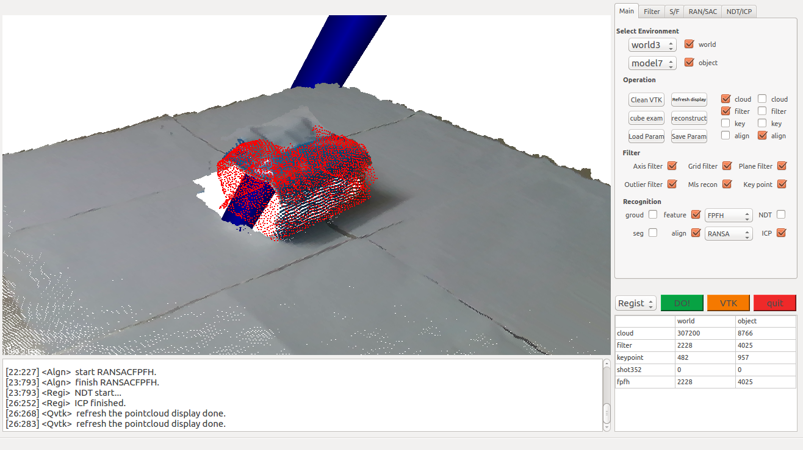
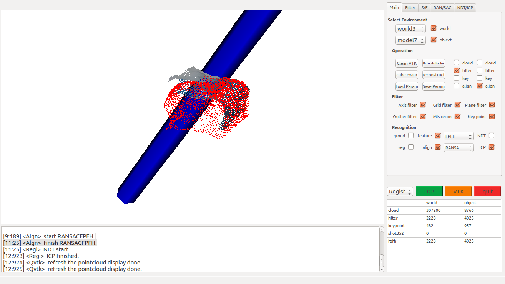
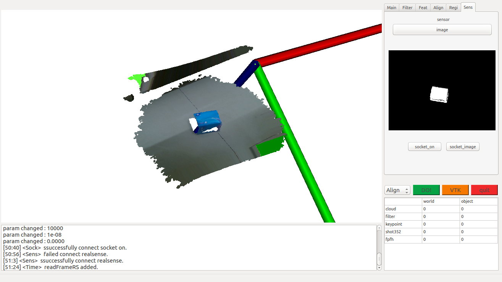
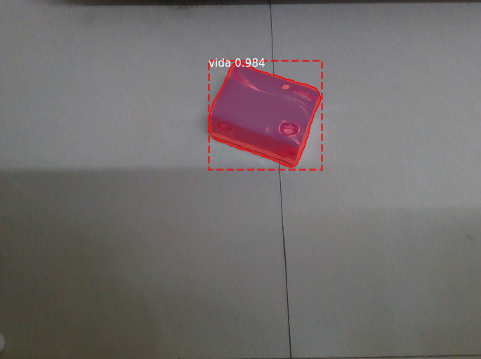
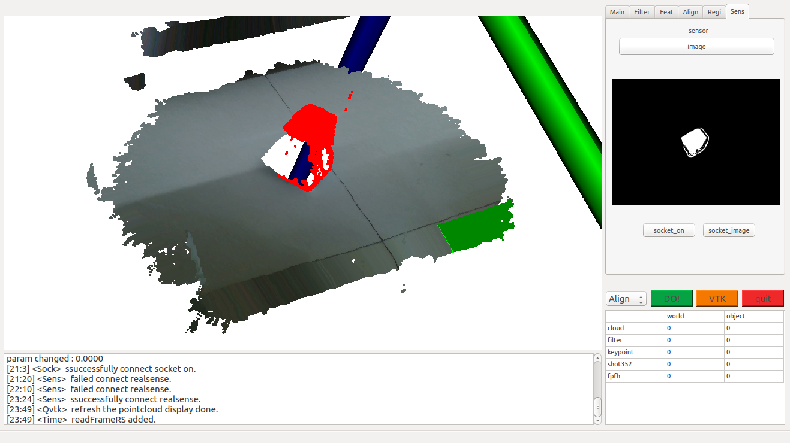
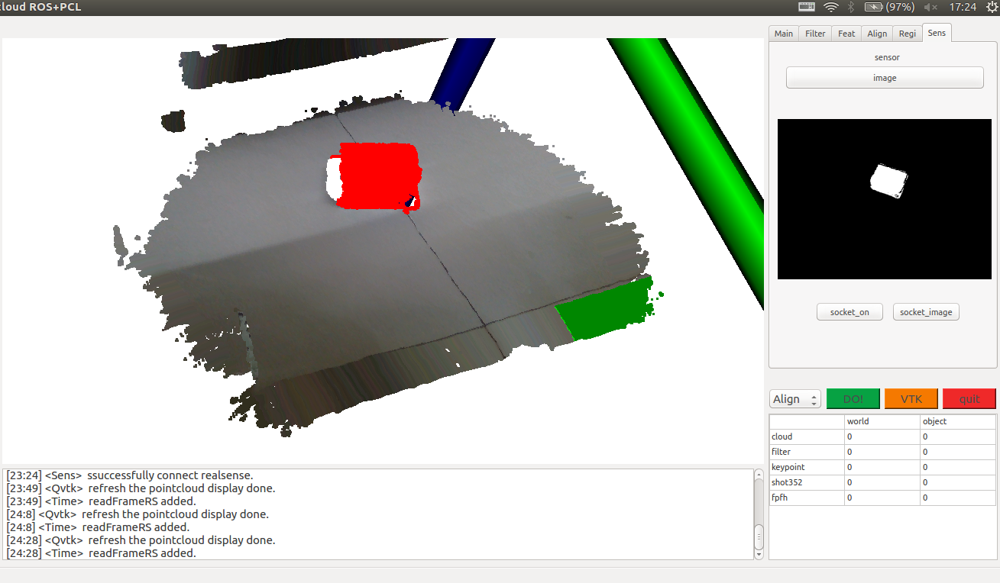

# object_detection-RCNN-Qt-PCL-ROS-GUI(under development)

### 1.Features

This catkin workspace have many features including **ROSnode, PCL process, Qt GUI, vtk widget**.
Besides, it contains **RCNN** implement(TF in Python) with socket communication.
It can be used in pointcloud recognition and model processing tasks.

This project includes the following detailed processing methods but not all of it:

* **feature-based method**

  ├─ pointcloud preprocess
  
  ├─ keypoint extract
  
  ├─ segmentation
  
  ├─ normal estimation
  
  ├─ feature compute
  
  ├─ surface reconstruct -- *MLS
  
  ├─ alignment -- *RANSAC *SACIA
  
  ├─ registration -- *NDT *ICP
  
  ├─ diff feature same reco -- *shot352 *fpfh

  ├─using Registration to get pose

  

* **DNN-based method**

  ├─RCNN for segmentation

  ├─using 2D segmentation to extract 3D pointcloud models (RGB mapping to Depth)

  ├─using Registration to get pose

  

**More detailed software description can be found in [software.md](./software.md)**

### 2.Functions

Performance of two methods to get a object pose or instance segmentation are shown below.

* **Feature-based method <hand craft descriptor>**

<div align="center"> </div>

Red pointclouds are **models** pre-processed using [CloudCompare](http://cloudcompare.org/) software. each of **The models** you want to get pose just need to get a model file in advance. You are **free from making a large dataset.** Once you get the model file, you can use it to **align the object** in the scene to **get** **its pose**.

However, this way needs great efforts to pre process the scene to get the partial pointcloud belonging to the model object(from left to right). So I rather use RCNN to do the recognition and segmentation works. Also this method is not the robust one.

* **DNN-based method<RCNN>**

<div align="center"> </div>

Once I get the pointcloud(left) and image(right), I can implement RCNN in image and get the **2D segmentation** of known object. (this can be done easily by famous image dataset. In other word, You still **free from making 3D pointcloud dataset.**) **More significant, you can make your own 3D pointcloud dataset using known 2D image dataset!** As long as you can tolerate the 2D image segmentation error.

The performance of RCNN-based dataset are pictured below.

<div align="center"> </div>

 Some outlier points are still been seen in left image, but it can be removed easily using traditional pointcloud cluster method.

* **More over...**

This project is just for higher robotic task till now. It has **ROS and Socket** Interface to interact with **DL framework and Robotics Simulation.**

### 3.Basic Steps

* main dependencies:
```
ROS-kinetic
PCL-1.71
Qt5
VTK6.2
CMake5<optional>

tensorflow-1.15.0
requirements.txt(/src/qt_ros_pcl/scripts/requirements.txt)
```

* Here are some basic instructions for implement.

```
git clone https://github.com/wangzivector/object_detection-Qt-PCL-ROS-GUI.git

cd catkin_qtws
catkin_make 
source ./devel/setup.sh

roscore 
rosrun qt_ros_pcl gui_node

/// this are not all step, you need to add more based on the system information.
/// As a project you have better check the code for learning, rather than just use it.
/// cause this project is essentially just for experiment.
```

* I recommend that you open and modify this project by Qtcreator-ros.
(the installation and configuration of qtcreator-ros are list in my other repository named **instructions_learning**.)

### 4.Notes

This repository is still under development. If there is any issue please inform it. 
